Automatic Offensive Language Detection In Danish (original dataset)
================
Aske Bredahl & Johan Horsmans

# Introduction:

This is the R-code for the bachelor project of Aske Bredahl &
Johan Horsmans; "Offensive Language Detection in Danish". In this tutorial
we will train the following models: Support Vector Machines, Naive
Bayes, Logistic Regression, Random Forest, LSTM, Bi-LSTM, C-LSTM
and a CNN. Furthermore, we will
design the ensemble support system described in the assignment.

# PART 1: Support Vector Machine, Naive Bayes, Random Forest & Logistic Regression.

## Step 0: Loading packages

``` r
# Loading/installing the required packages:
library(pacman)
p_load(readr, tidyverse,rsample, recipes, textrecipes, parsnip, yardstick,workflows, discrim,kernlab,stringr, tm, ggplot2, GGally, e1071, caret,stopwords, stringi, SnowballC,fastmatch, parsnip, keras, tensorflow, ranger, MLmetrics, deepviz, magrittr, ggthemes)

# You have to run these two lines in order to knit the file as an md-file:
#install.packages("webshot")
#webshot::install_phantomjs()
```

## Step 1: Loading data:

``` r
# Defining function to read the data:
loading_data <- function(path) {
  read_delim(path, "\t", escape_double = FALSE, trim_ws = TRUE)
}

# Loading the training- and testing data:
training <- loading_data("offenseval-da-training-v1.tsv") %>% 
          mutate(Id = id,label = factor(subtask_a),text=tweet) %>% 
          na.omit()
```

``` r
testing<-loading_data("offenseval-da-test-v1.tsv") %>% 
          mutate(Id = id,label = factor(subtask_a),text=tweet) %>% 
          na.omit()
```

## Step 2: Preprocessing:

``` r
# Make text lowercase
training$text<-tolower(training$text) 

# Remove stopwords:
stopwords_regex = paste(stopwords("da",source= "snowball"), collapse = '\\b|\\b')
stopwords_regex = paste0('\\b', stopwords_regex, '\\b')
training$text = stringr::str_replace_all(training$text, stopwords_regex, '')

# Remove numbers:
training$text <-  removeNumbers(training$text)

# Stem words:
training$text <-  wordStem(training$text, language = "danish")

# Remove punctuation
training$text<-removePunctuation(training$text)

# Repeat same procedures for test data
testing$text<-tolower(testing$text) 
stopwords_regex = paste(stopwords("da",source= "snowball"), collapse = '\\b|\\b')
stopwords_regex = paste0('\\b', stopwords_regex, '\\b')
testing$text = stringr::str_replace_all(testing$text, stopwords_regex, '')
testing$text <-  removeNumbers(testing$text)
testing$text <-  wordStem(testing$text, language = "danish")
testing$text<-removePunctuation(testing$text)

# Remove original data columns:
training<-training[,4:6]
testing<-testing[,4:6]
```

# Inspect training data:

``` r
head(training)
```

    ## # A tibble: 6 x 3
    ##      Id label text                                                              
    ##   <dbl> <fct> <chr>                                                             
    ## 1  3131 NOT   " tror    dejlig køligt        svært såfremt personen  billedet  ~
    ## 2   711 NOT   "så kommer  nok   investere   ny cykelpumpe så landbetjenten kan ~
    ## 3  2500 OFF   "      ikeaaber   lavet spillet     gør  uspilleligt"             
    ## 4  2678 NOT   " varme emails   enige     sextilbud   indgående opkald lyder   m~
    ## 5   784 NOT   "desværre tyder    amerikanerne  helt ude  kontrol   kan stemme  ~
    ## 6  3191 NOT   "  fordi  danske børn  folkeskolerne     grund både  dårligere   ~

## Step 3: Naive Bayes-, Logistic Regression-, Support Vector Machine- & Random Forest models using tidymodels (recipe/workflows) framework.

We start off creating the text treatment recipe:

``` r
# Create text recipe for Naive Bayes model:
text_recipe_NB <- recipe(label ~ ., data = training) %>% 
  update_role(Id, new_role = "ID") %>% 
  step_tokenize(text, engine = "tokenizers", token = "words") %>%
  step_tokenfilter(text, max_tokens = 100) %>% #Best = 100
  step_tfidf(text)

# Create text recipe for Logistic Regression model:
text_recipe_LOG <- recipe(label ~ ., data = training) %>% 
  update_role(Id, new_role = "ID") %>% 
  step_tokenize(text, engine = "tokenizers", token = "words") %>%
  step_tokenfilter(text, max_tokens = 125) %>% #Best = 125
  step_tfidf(text)

# Create text recipe for Support Vector Machine model:
text_recipe_SVM <- recipe(label ~ ., data = training) %>% 
  update_role(Id, new_role = "ID") %>% 
  step_tokenize(text, engine = "tokenizers", token = "words") %>%
  step_tokenfilter(text, max_tokens = 10000) %>% #Best so far 10000
  step_tfidf(text)

# Create text recipe for Random Forest model:
text_recipe_RF <- recipe(label ~ ., data = training) %>% 
  update_role(Id, new_role = "ID") %>% 
  step_tokenize(text, engine = "tokenizers", token = "words") %>%
  step_tokenfilter(text, max_tokens = 2500) %>% #Best = 2500
  step_tfidf(text)
```

Setting the model specifications to make them ready for classification:

``` r
# Naive Bayes
text_model_NB_spec <- naive_Bayes() %>% set_engine("naivebayes") %>% set_mode("classification")

# Logistic Regression
text_model_log_spec <- logistic_reg() %>% set_engine("glm") %>% set_mode("classification")

# SVM
text_model_svm_spec <- svm_poly("classification") %>% set_engine("kernlab")

# Random Forest
text_model_rf_spec <- rand_forest("classification") %>% set_engine("randomForest")
```

Combining the model specification and the text processing recipe into a
combined workflow:

``` r
# Naive Bayes:
text_model_NB_wf <- workflows::workflow() %>% add_recipe(text_recipe_NB) %>% add_model(text_model_NB_spec)

# Logistic Regression:
text_model_log_wf <- workflows::workflow() %>% add_recipe(text_recipe_LOG) %>% add_model(text_model_log_spec)

# SVM
text_model_svm_wf <- workflows::workflow() %>% add_recipe(text_recipe_SVM) %>% add_model(text_model_svm_spec)

# Random Forest
text_model_rf_wf <- workflows::workflow() %>% add_recipe(text_recipe_RF) %>% add_model(text_model_rf_spec)
```

## Step 4: Fitting

Fit the models on the training data:

``` r
# Naive Bayes
fit_NB_model <- fit(text_model_NB_wf, training)

# Logistic Regression
fit_log_model <- fit(text_model_log_wf, training)
```

``` r
# SVM
fit_svm_model <- fit(text_model_svm_wf, training)
```

``` r
# Random Forest
fit_rf_model <- fit(text_model_rf_wf, training)
```

## Step 5: Predictions:

Making the models predict the classes of the test data:

``` r
# Naive Bayes
predictions_NB <- predict(fit_NB_model, testing,type="class") # Classifications
predictions_NB$raw_NB <- predict(fit_NB_model, testing,type="prob") # Raw probabilities

# Logistic Regression
predictions_log <- predict(fit_log_model, testing) # Classifications
predictions_log$raw_log <- predict(fit_log_model, testing,type="prob") # Raw probabilities

# SVM
predictions_SVM <- stats::predict(fit_svm_model, testing,type="class") # Classifications
predictions_SVM$raw_svm <- stats::predict(fit_svm_model, testing,type="prob") # Raw probabilities

# Random Forest
predictions_RF <- stats::predict(fit_rf_model, testing,type="class") # Classifications
predictions_RF$raw_rf <- stats::predict(fit_rf_model, testing,type="prob") # Raw probabilities
```

## Step 6: Evaluate

Making confusion matrices for the predictions:

### Naive Bayes

``` r
bind_cols(testing,predictions_NB) %>% 
  conf_mat(label, .pred_class) %>%
  pluck(1) %>%
  as_tibble() %>%
  ggplot(aes(Prediction, Truth, alpha = n)) +
  geom_tile(show.legend = FALSE) +
  geom_text(aes(label = n), colour = "white", alpha = 1, size = 8) + 
  theme_economist()
```

<!-- -->

### Logistic Regression:

``` r
bind_cols(testing,predictions_log) %>%
  conf_mat(label, .pred_class) %>%
  pluck(1) %>%
  as_tibble() %>%
  ggplot(aes(Prediction, Truth, alpha = n)) +
  geom_tile(show.legend = FALSE) +
  geom_text(aes(label = n), colour = "white", alpha = 1, size = 8) + 
  theme_economist()
```

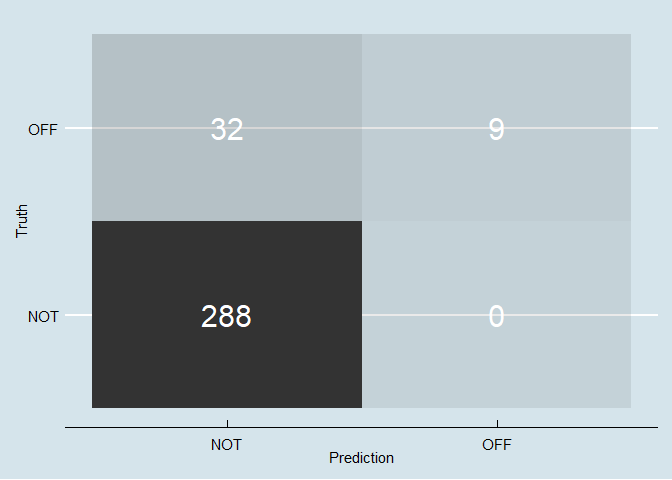<!-- -->

### SVM

``` r
bind_cols(testing,predictions_SVM) %>%
  conf_mat(label, .pred_class) %>%
  pluck(1) %>%
  as_tibble() %>%
  ggplot(aes(Prediction, Truth, alpha = n)) +
  geom_tile(show.legend = FALSE) +
  geom_text(aes(label = n), colour = "white", alpha = 1, size = 8) + 
  theme_economist()
```

<!-- -->

### Random Forest:

``` r
bind_cols(testing,predictions_RF) %>%
  conf_mat(label, .pred_class) %>%
  pluck(1) %>%
  as_tibble() %>%
  ggplot(aes(Prediction, Truth, alpha = n)) +
  geom_tile(show.legend = FALSE) +
  geom_text(aes(label = n), colour = "white", alpha = 1, size = 8) + 
  theme_economist()
```

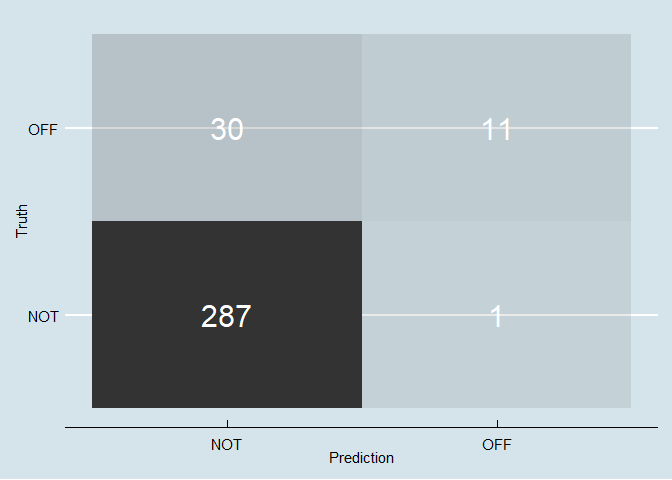<!-- -->

Calculating macro
F1-score

### Naive Bayes

``` r
F1_Score_macro(y_true= as.numeric(testing$label), y_pred = as.numeric(predictions_NB$.pred_class))
```

    ## [1] 0.5364415

### Logistic Regression

``` r
F1_Score_macro(y_true= as.numeric(testing$label), y_pred = as.numeric(predictions_log$.pred_class))
```

    ## [1] 0.7427678

### SVM

``` r
F1_Score_macro(y_true= as.numeric(testing$label), y_pred = as.numeric(predictions_SVM$.pred_class))
```

    ## [1] 0.6130428

### Random Forest

``` r
F1_Score_macro(y_true= as.numeric(testing$label), y_pred = as.numeric(predictions_RF$.pred_class))
```

    ## [1] 0.746567

# PART 2: Neural Networks.

## Step 1: Preprocessing:

### LSTM

Format data for Keras
framework:

``` r
#Labels are converted to numeric in order to be compatible with the Keras framework.
training$label<-as.numeric(training$label)-1
testing$label<-as.numeric(testing$label)-1

# Inspect training data:
head(training)
```

    ## # A tibble: 6 x 3
    ##      Id label text                                                              
    ##   <dbl> <dbl> <chr>                                                             
    ## 1  3131     0 " tror    dejlig køligt        svært såfremt personen  billedet  ~
    ## 2   711     0 "så kommer  nok   investere   ny cykelpumpe så landbetjenten kan ~
    ## 3  2500     1 "      ikeaaber   lavet spillet     gør  uspilleligt"             
    ## 4  2678     0 " varme emails   enige     sextilbud   indgående opkald lyder   m~
    ## 5   784     0 "desværre tyder    amerikanerne  helt ude  kontrol   kan stemme  ~
    ## 6  3191     0 "  fordi  danske børn  folkeskolerne     grund både  dårligere   ~

Tokenize the data for the neural networks:

``` r
# Vectorize the text corpus (include the 20,000 most prevalent words):
max_features <- 20000

# Train
text <- training$text
tokenizer <- text_tokenizer(num_words = max_features)

# Test
text_test <- testing$text
tokenizer_test <- text_tokenizer(num_words = max_features)

# Update tokenizer internal vocabulary.
# Train
tokenizer %>% 
  fit_text_tokenizer(text)

# Test
tokenizer_test %>% 
  fit_text_tokenizer(text_test)
```

Inspect data:

``` r
# How many documents was the tokenizer used on:

# Train
tokenizer$document_count
```

    ## [1] 2960

``` r
# Test
tokenizer_test$document_count
```

    ## [1] 329

``` r
#How many tokens/words are there:

#Train
tokenizer$num_words
```

    ## [1] 20000

``` r
#Test
tokenizer_test$num_words
```

    ## [1] 20000

Transform each text to a sequence of integers using the tokenizer.

``` r
# Train
text_seqs <- texts_to_sequences(tokenizer, text) 

# Insepect
text_seqs %>% 
  head()
```

    ## [[1]]
    ## [1]   42  620 3428  181 2020 1433  218  621 3429
    ## 
    ## [[2]]
    ##  [1]    1   22   10 3430  254 3431    1 3432    2 2021 1434
    ## 
    ## [[3]]
    ## [1] 3433  132  542   27 2022
    ## 
    ## [[4]]
    ## [1]  480 2023  894 3434 3435 1435  255 1436
    ## 
    ## [[5]]
    ##  [1]  219 2024  622   14  256 1097    2  481    1 1437   57
    ## 
    ## [[6]]
    ##  [1]   34   23  140 3436  133  257  895 2025    1   39  310 3437  744

``` r
# Test
text_seqs_test <- texts_to_sequences(tokenizer_test, text_test) 
```

``` r
# Cut texts after this number of words (among most common words)
maxlen <- 100 
```

``` r
# Train
x_train <- text_seqs %>%
  pad_sequences(maxlen = maxlen)

# How many documents and words are there?
dim(x_train) 
```

    ## [1] 2960  100

``` r
# Test
x_test <- text_seqs_test %>%
  pad_sequences(maxlen = maxlen)
dim(x_test)
```

    ## [1] 329 100

Make lists with labels

``` r
# Train
y_train <- training$label

# How many labels (check if this matches amount of documents in x_train)
length(y_train)
```

    ## [1] 2960

``` r
# Test
y_test <- testing$label

# How many labels (check if this matches amount of documents in x_train)
length(y_test)
```

    ## [1] 329

## Step 2: Model specifications

Define model in Keras and set specifications:

``` r
# Set batch size:
batch_size <- 64 

# Set epochs:
epochs <- 15

model_lstm <- keras_model_sequential()
model_lstm %>%
  layer_embedding(input_dim = max_features, output_dim = 128) %>% 
  layer_lstm(units = 64, dropout = 0.2, recurrent_dropout = 0.2) %>% 
  layer_dense(units = 1, activation = 'sigmoid') 

# Set loss function, optimizer and what metrics to include in evaluation plots.
model_lstm %>% compile(
  loss = 'binary_crossentropy',
  optimizer = 'adam'
)
```

Plot
model:

``` r
model_lstm %>% plot_model() 
```

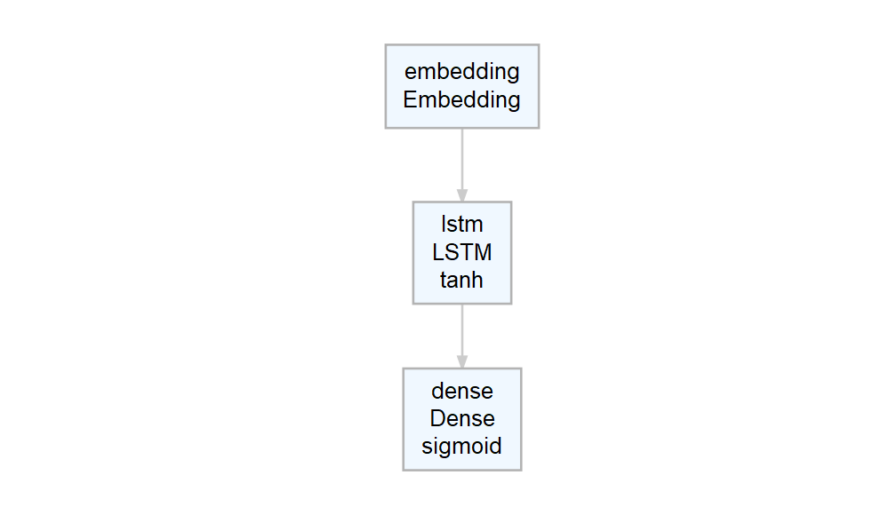<!-- -->

## Step 3: Fit model:

``` r
history_lstm <- model_lstm %>% fit(
  x_train, y_train,
  batch_size = batch_size,
  epochs = epochs,
  validation_data = list(x_test, y_test)
)
```

Plot training
epochs

``` r
plot(history_lstm,method= "ggplot2") + theme_economist() +scale_colour_economist()
```

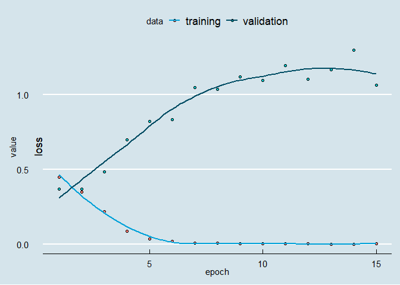<!-- -->

## Step 4: Predictions:

``` r
predictions_lstm<-c()
predictions_lstm$.preds <- as.factor(predict_classes(model_lstm, x_test))
predictions_lstm$raw <- predict_proba(model_lstm, x_test) # Raw prob
```

## Step 5: Evaluate:

``` r
testing$label<-as.factor(testing$label)

bind_cols(testing,predictions_lstm) %>%
  conf_mat(label, .preds) %>%
  pluck(1) %>%
  as_tibble() %>%
  ggplot(aes(Prediction, Truth, alpha = n)) +
  geom_tile(show.legend = FALSE) +
  geom_text(aes(label = n), colour = "white", alpha = 1, size = 8) + 
  theme_economist()
```

<!-- -->

``` r
testing$label<-as.numeric(testing$label)-1
```

## Append to neural probs dataframe (for later ensembling)

``` r
neural_probs <- data.frame(predict_LSTM
                           = predict_classes(model_lstm, x_test))
neural_probs$raw_probs_off_LSTM<-predict_proba(model_lstm, x_test)
neural_probs$raw_probs_not_LSTM<-1-neural_probs$raw_probs_off_LSTM
```

## F1-scores

``` r
F1_Score_macro(y_true= testing$label, y_pred = as.numeric(predictions_lstm$.preds)-1)
```

    ## [1] 0.5180302

### Convoluted Neural Network

## Step 1: Preprocessing:

``` r
# Cut texts after this number of words (among most common words)
maxlen <- 250 
```

``` r
# Train
x_train <- text_seqs %>%
  pad_sequences(maxlen = maxlen)

# How many documents and words are there?
dim(x_train) 
```

    ## [1] 2960  250

``` r
# Test
x_test <- text_seqs_test %>%
  pad_sequences(maxlen = maxlen)
dim(x_test) 
```

    ## [1] 329 250

## Step 2: Model specifications

Define model in Keras and set specifications:

``` r
batch_size <- 64
embedding_dims <- 50
filters <- 250
kernel_size <- 3
hidden_dims <- 250

model_cnn <- keras_model_sequential()
model_cnn %>% 
  layer_embedding(max_features, embedding_dims, input_length = maxlen) %>%
  layer_dropout(0.2) %>%
  layer_conv_1d(
    filters, kernel_size, 
    padding = "valid", activation = "relu", strides = 1
  ) %>%
  layer_global_max_pooling_1d() %>%
  layer_dense(hidden_dims) %>%
  layer_dropout(0.2) %>%
  layer_activation("relu") %>%
  layer_dense(1) %>%
  layer_activation("sigmoid")

# Set learning rate for the adam optimizer.
optimizer_adam(
  lr = 0.001)
```

    ## <tensorflow.python.keras.optimizer_v2.adam.Adam>

``` r
# Set loss function, optimizer and what metrics to include in evaluation plots.
model_cnn %>% compile(
  loss = "binary_crossentropy",
  optimizer = "adam",
  metrics = c("accuracy","Precision","Recall")
)
```

Plot
model:

``` r
model_cnn %>% plot_model()
```

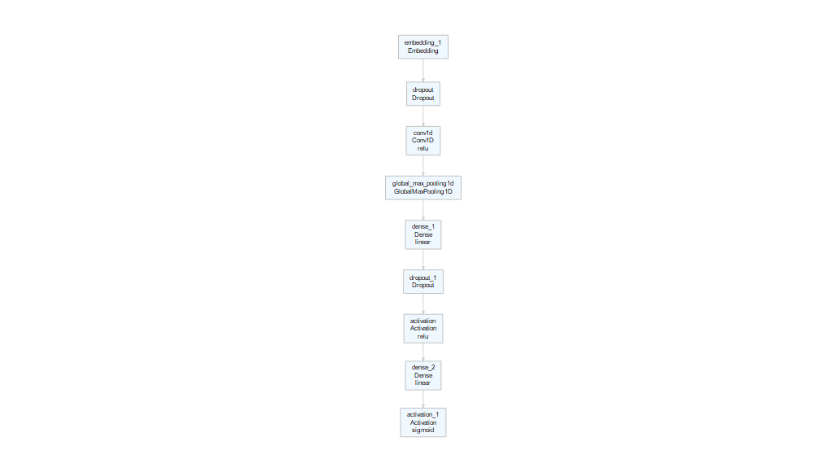<!-- -->

## Step 3: Fit model:

``` r
history_cnn <- model_cnn %>% fit(
  x_train, y_train,
  batch_size = batch_size,
  epochs = 50,
  validation_data = list(x_test, y_test)
)
```

Plot training
epochs

``` r
plot(history_cnn,method= "ggplot2") + theme_economist() +scale_colour_economist()
```

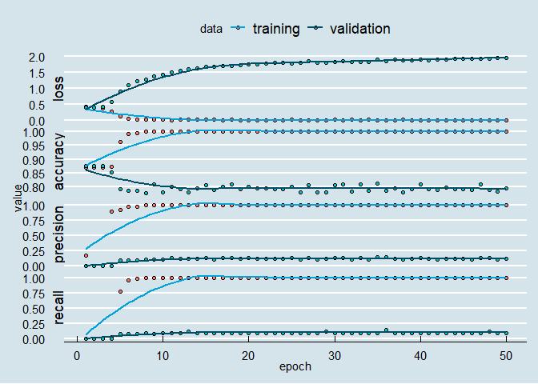<!-- -->

Set specifications for second round of training

``` r
# Set learning rate for the adam optimizer.
optimizer_adam(
  lr = 0.006)
```

    ## <tensorflow.python.keras.optimizer_v2.adam.Adam>

``` r
# Make learning rate decrease by 0.001 if there af 5 consecutive epochs without improvement of the recall on validation data.
callback_reduce_lr_on_plateau(
  monitor = "loss", #Is this legit??
  factor = 0.001, 
  patience = 5, 
  verbose = 0,
  mode = c("auto", "min", "max"),
  min_delta = 1e-04,
  cooldown = 0,
  min_lr = 0
)
```

    ## <tensorflow.python.keras.callbacks.ReduceLROnPlateau>

``` r
# Compile model
model_cnn %>% compile(
  loss = "binary_crossentropy",
  optimizer = "adam",
)
```

``` r
history_cnn <- model_cnn %>% fit(
  x_train, y_train,
  batch_size = batch_size,
  epochs = 70, 
  validation_data = list(x_test, y_test)
)
```

Plot training
epochs

``` r
plot(history_cnn,method= "ggplot2") + theme_economist() +scale_colour_economist()
```

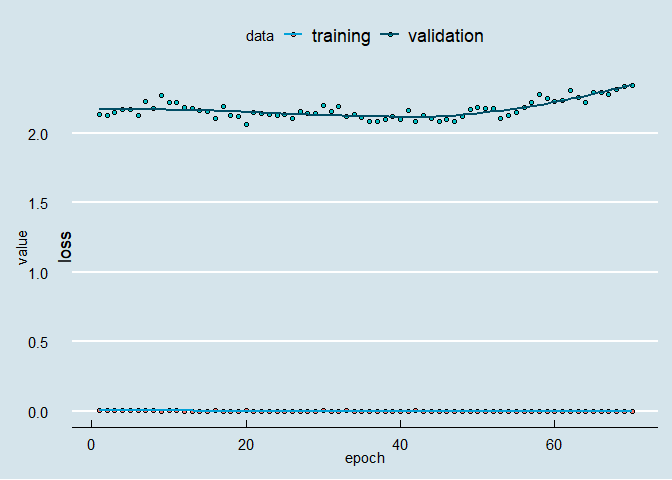<!-- -->

## Step 4: Predictions:

``` r
predictions_cnn<-c()
predictions_cnn$.preds <- as.factor(predict_classes(model_cnn, x_test))
predictions_cnn$raw <- predict_proba(model_cnn, x_test) # Raw prob
```

## Step 5: Evaluate

``` r
testing$label<-as.factor(testing$label)

bind_cols(testing,predictions_cnn) %>%
  conf_mat(label, .preds) %>%
  pluck(1) %>%
  as_tibble() %>%
  ggplot(aes(Prediction, Truth, alpha = n)) +
  geom_tile(show.legend = FALSE) +
  geom_text(aes(label = n), colour = "white", alpha = 1, size = 8) + 
  theme_economist()
```

<!-- -->

``` r
testing$label<-as.numeric(testing$label)-1
```

``` r
## Append to neural probs dataframe (for later ensembling)
neural_probs$predict_CNN <- predict_classes(model_cnn, x_test)
neural_probs$raw_probs_off_CNN<-predict_proba(model_cnn, x_test)
neural_probs$raw_probs_not_CNN<-1-neural_probs$raw_probs_off_CNN
```

## F1-scores

``` r
F1_Score_macro(y_true= testing$label, y_pred = as.numeric(predictions_cnn$.preds)-1)
```

    ## [1] 0.5056718

### CNN LSTM:

## Step 1: Preprocessing:

``` r
# Cut sentences above 100 words:
maxlen = 100
```

``` r
# Train
x_train <- text_seqs %>%
  pad_sequences(maxlen = maxlen)
# How many documents and words are there?
dim(x_train) 
```

    ## [1] 2960  100

``` r
# Test
x_test <- text_seqs_test %>%
  pad_sequences(maxlen = maxlen)
dim(x_test) 
```

    ## [1] 329 100

## Step 2: Model specifications

``` r
embedding_size = 128
kernel_size = 5
filters = 64
pool_size = 4
lstm_output_size = 70
batch_size = 64
epochs = 50
```

``` r
# Defining Model ------------------------------------------------------
model_cnn_lstm <- keras_model_sequential()
model_cnn_lstm %>%
  layer_embedding(max_features, embedding_size, input_length = maxlen) %>%
  layer_dropout(0.25) %>%
  layer_conv_1d(
    filters, 
    kernel_size, 
    padding = "valid",
    activation = "relu",
    strides = 1
  ) %>%
  layer_max_pooling_1d(pool_size) %>%
  layer_lstm(lstm_output_size) %>%
  layer_dense(1) %>%
  layer_activation("sigmoid")

# Set learning rate for the adam optimizer.
optimizer_adam(
  lr = 0.001)
```

    ## <tensorflow.python.keras.optimizer_v2.adam.Adam>

``` r
# Set loss function, optimizer and what metrics to include in evaluation plots.
model_cnn_lstm %>% compile(
  loss = "binary_crossentropy",
  optimizer = "adam"
)
```

``` r
model_cnn_lstm %>% plot_model()
```

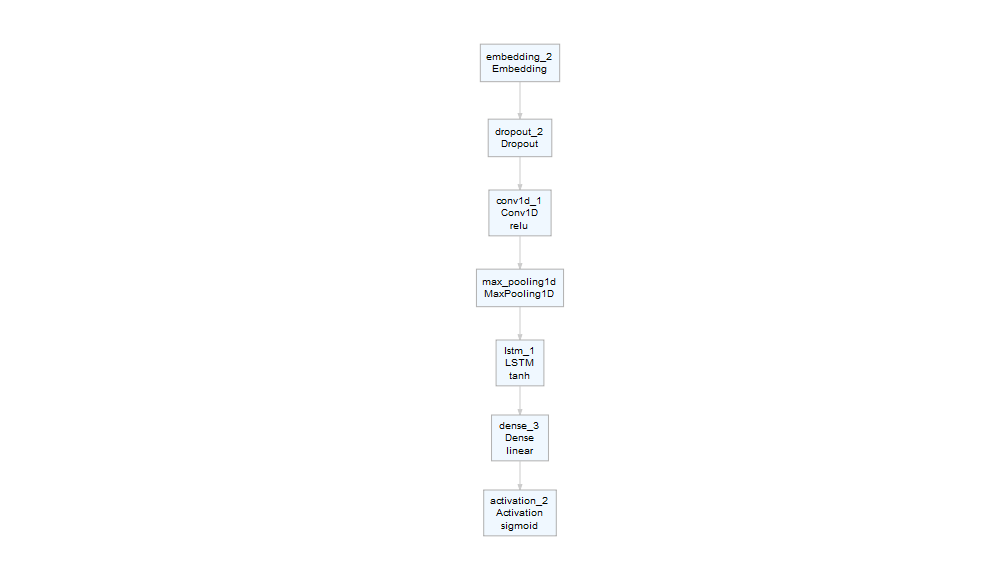<!-- -->

## Step 3: Fit model:

``` r
history_cnn_lstm <- model_cnn_lstm %>% fit(
  x_train, y_train,
  batch_size = batch_size,
  epochs = epochs,
  validation_data = list(x_test, y_test)
)
```

Plot training
epochs:

``` r
plot(history_cnn_lstm,method= "ggplot2") + theme_economist() +scale_colour_economist()
```

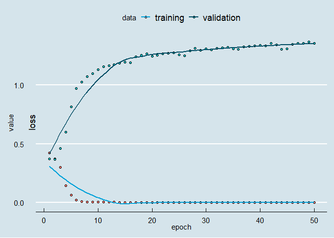<!-- -->

## Step 4: Predictions:

``` r
predictions_cnn_lstm <- c()
predictions_cnn_lstm$.preds <- as.factor(predict_classes(model_cnn_lstm, x_test))
predictions_cnn_lstm$raw <- predict_proba(model_cnn_lstm, x_test)
```

## Step 5: Evaluate:

``` r
testing$label<-as.factor(testing$label)

bind_cols(testing,predictions_cnn_lstm) %>%
  conf_mat(label, .preds) %>%
  pluck(1) %>%
  as_tibble() %>%
  ggplot(aes(Prediction, Truth, alpha = n)) +
  geom_tile(show.legend = FALSE) +
  geom_text(aes(label = n), colour = "white", alpha = 1, size = 8) + 
  theme_economist()
```

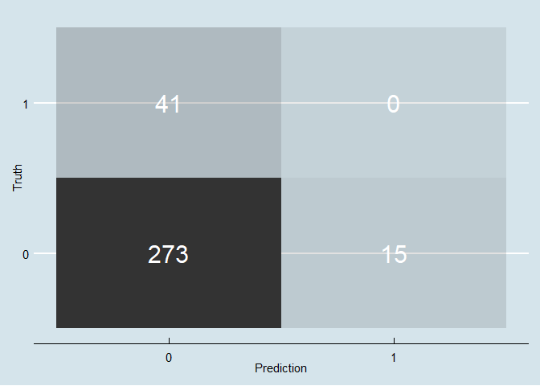<!-- -->

``` r
testing$label<-as.numeric(testing$label)-1
```

## Append to neural probs dataframe (for later ensembling)

``` r
neural_probs$predict_CNN_LSTM<-predict_classes(model_cnn_lstm, x_test) #Predict class
neural_probs$raw_probs_off_CNN_LSTM<-predict_proba(model_cnn_lstm, x_test) #Predict raw probabilites (prob of tweet = OFF)
neural_probs$raw_probs_not_CNN_LSTM<-1-neural_probs$raw_probs_off_CNN_LSTM
```

## F1-scores

``` r
F1_Score_macro(y_true= testing$label, y_pred = as.numeric(predictions_cnn_lstm$.preds)-1)
```

    ## [1] 0.4534884

## Bi-directional LSTM

## Step 1: Model specifications

``` r
batch_size <- 64
epochs <- 50
```

``` r
# Defining Model ------------------------------------------------------
model_bilstm <- keras_model_sequential()
model_bilstm %>%
  layer_embedding(input_dim = max_features, 
                  output_dim = 128, 
                  input_length = maxlen) %>% 
  bidirectional(layer_lstm(units = 64)) %>%
  layer_dropout(rate = 0.5) %>% 
  layer_dense(units = 1, activation = 'sigmoid')

# Set learning rate for the adam optimizer.
optimizer_adam(
  lr = 0.001)
```

    ## <tensorflow.python.keras.optimizer_v2.adam.Adam>

``` r
# Set learning rate for the adam optimizer.
model_bilstm %>% compile(
  loss = 'binary_crossentropy',
  optimizer = 'adam'
)
```

Plot
model

``` r
model_bilstm %>% plot_model() 
```

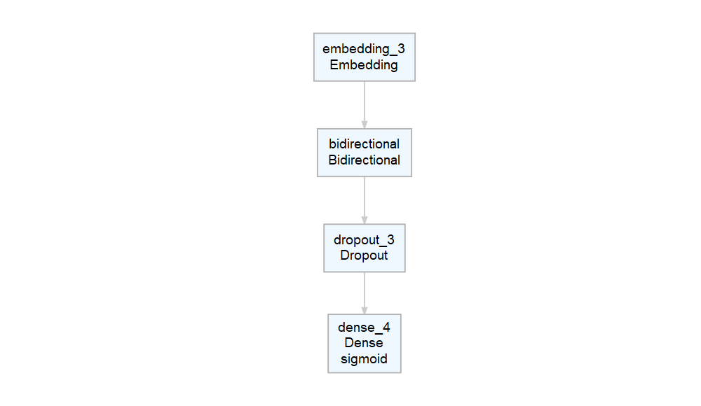<!-- -->

## Step 2: Fit model:

``` r
# Train model over four epochs
history_bilstm <- model_bilstm %>% fit(
  x_train, y_train,
  batch_size = batch_size,
  epochs = epochs,
  validation_data = list(x_test, y_test)
)
```

Plot training
epochs

``` r
plot(history_bilstm,method= "ggplot2", smooth = TRUE) + theme_economist() +scale_colour_economist()
```

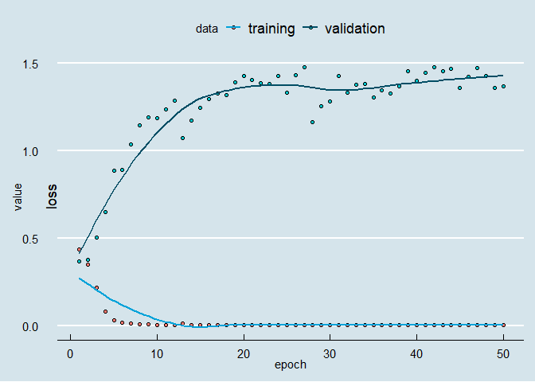<!-- -->

## Step 3: Prediction

``` r
predictions_bilstm <- c()

predictions_bilstm$.preds <- as.factor(predict_classes(model_bilstm, x_test))
predictions_bilstm$raw <- predict_proba(model_bilstm, x_test)
```

## Step 4: Evaluate:

``` r
testing$label<-as.factor(testing$label)

bind_cols(testing,predictions_bilstm) %>%
  conf_mat(label, .preds) %>%
  pluck(1) %>%
  as_tibble() %>%
  ggplot(aes(Prediction, Truth, alpha = n)) +
  geom_tile(show.legend = FALSE) +
  geom_text(aes(label = n), colour = "white", alpha = 1, size = 8) + 
  theme_economist()
```

<!-- -->

``` r
testing$label<-as.numeric(testing$label)-1
```

## Append to neural probs dataframe (for later ensembling)

``` r
neural_probs$predict_BILSTM<-predict_classes(model_bilstm, x_test) #Predict class
neural_probs$raw_probs_off_BILSTM<-predict_proba(model_bilstm, x_test) #Predict raw probabilites (prob of tweet = OFF)
neural_probs$raw_probs_not_BILSTM<-1-neural_probs$raw_probs_off_BILSTM
```

## F1-scores

``` r
F1_Score_macro(y_true= testing$label, y_pred = as.numeric(predictions_bilstm$.preds)-1)
```

    ## [1] 0.4819269

# PART 3: BERT-model evaluation.

Loading BERT results-table data (the model has been trained in python):

``` r
BERTdata<-read_csv("OG_BERT_RESULTS.csv")

# Turning raw probabilites into binary predictions:
BERTdata$preds_249<-ifelse(BERTdata[,1] > 0.5, 0, 1)
```

Calculating macro F1 score

``` r
# BERT model (final checkpoint):
F1_Score_macro(y_true= as.numeric(testing$label), y_pred = (BERTdata$preds_249))
```

    ## [1] 0.8466877

## Self-ensembled BERT model

``` r
BERTensemble <- read.csv2("Bert-data/test_results (249).tsv", sep="\t", header=FALSE, col.names = c("NOT_249", "OFF_249"))

BERTensemble <- bind_cols(BERTensemble,read.csv2("Bert-data/test_results (225).tsv", sep="\t", header=FALSE,col.names = c("NOT_225", "OFF_225")))

BERTensemble <- bind_cols(BERTensemble,read.csv2("Bert-data/test_results (200).tsv", sep="\t", header=FALSE,col.names = c("NOT_200", "OFF_200")))

BERTensemble <- bind_cols(BERTensemble,read.csv2("Bert-data/test_results (175).tsv", sep="\t", header=FALSE,col.names = c("NOT_175", "OFF_175")))

BERTensemble <- bind_cols(BERTensemble,read.csv2("Bert-data/test_results (150).tsv", sep="\t", header=FALSE,col.names = c("NOT_150", "OFF_150")))

BERTensemble <- bind_cols(BERTensemble,read.csv2("Bert-data/test_results (125).tsv", sep="\t", header=FALSE,col.names = c("NOT_125", "OFF_125")))

BERTensemble <- bind_cols(BERTensemble,read.csv2("Bert-data/test_results (100).tsv", sep="\t", header=FALSE,col.names = c("NOT_100", "OFF_100")))

BERTensemble <- bind_cols(BERTensemble,read.csv2("Bert-data/test_results (75).tsv", sep="\t", header=FALSE,col.names = c("NOT_75", "OFF_75")))

BERTensemble <- bind_cols(BERTensemble,read.csv2("Bert-data/test_results (50).tsv", sep="\t", header=FALSE,col.names = c("NOT_50", "OFF_50")))

BERTensemble <- bind_cols(BERTensemble,read.csv2("Bert-data/test_results (25).tsv", sep="\t", header=FALSE,col.names = c("NOT_25", "OFF_25")))

# Making columns numeric:
BERTensemble[,1:20] = apply(BERTensemble[,1:20], 2, function(x) as.numeric(as.character(x)));

# Calculating average probability of a comment being non-offensive
BERTensemble$Final_NOT<-(BERTensemble[,1]+BERTensemble[,3]+BERTensemble[,5]+BERTensemble[,7]+BERTensemble[,9]+BERTensemble[,11]+BERTensemble[,13]+BERTensemble[,15]+BERTensemble[,17]+BERTensemble[,19])/10

# Calculating average probability of a comment being offensive
BERTensemble$Final_OFF<-(BERTensemble[,2]+BERTensemble[,4]+BERTensemble[,6]+BERTensemble[,8]+BERTensemble[,10]+BERTensemble[,12]+BERTensemble[,14]+BERTensemble[,16]+BERTensemble[,18]+BERTensemble[,20])/10
```

``` r
# Turning raw probabilites into binary predictions:
BERTensemble$Final_preds<-ifelse(BERTensemble$Final_NOT > 0.5, 0, 1)
```

## Calculating macro F1 Score for the self-ensembled BERT model

``` r
F1_Score_macro(y_true= as.numeric(testing$label), y_pred = (BERTensemble$Final_preds))
```

    ## [1] 0.7969442

# PART 4: Ensemble averaging pipeline:

``` r
#Load BERT data again:
Bert_results<-read_csv("OG_BERT_RESULTS.csv")

#Create ensemble with raw probs of other models:
Ensemble_probabilities<-predictions_SVM$raw_svm
Ensemble_probabilities$SVM<-predictions_SVM$raw_svm
Ensemble_probabilities<-Ensemble_probabilities[,3]
Ensemble_probabilities$NB<-predictions_NB$raw_NB
Ensemble_probabilities$log<-predictions_log$raw_log
Ensemble_probabilities$RF<-predictions_RF$raw_rf
Ensemble_probabilities$cnn_pred_off<-neural_probs$raw_probs_off_CNN
Ensemble_probabilities$cnn_pred_not<-neural_probs$raw_probs_not_CNN
Ensemble_probabilities$lstm_pred_off<-neural_probs$raw_probs_off_LSTM
Ensemble_probabilities$lstm_pred_not<-neural_probs$raw_probs_not_LSTM
Ensemble_probabilities$cnn_lstm_pred_off<-neural_probs$raw_probs_off_CNN_LSTM
Ensemble_probabilities$cnn_lstm_pred_not<-neural_probs$raw_probs_not_CNN_LSTM
Ensemble_probabilities$bilstm_pred_off<-neural_probs$raw_probs_off_BILSTM
Ensemble_probabilities$bilstm_pred_not<-neural_probs$raw_probs_not_BILSTM

#Define empty columns in ensemble probabilites set
Ensemble_probabilities$ensemble1_plus_bert_probs_off<-1
Ensemble_probabilities$ensemble1_plus_bert_probs_not<-1
Ensemble_probabilities$avg_preds_bert_plus_ensemble1<-1
testing$support_system<-1
Ensemble_probabilities$bertpreds<-BERTdata$preds_249
Ensemble_probabilities$bert_off<-Bert_results$`1`
Ensemble_probabilities$bert_not<-Bert_results$`0`
```

Ensemble 1

``` r
#Calculating average OFF BERT + Ensemble probability (Ensemble 1)
for (i in 1:nrow(Ensemble_probabilities)){
Ensemble_probabilities$ensemble1_plus_bert_probs_off[i] <- (Ensemble_probabilities$SVM$.pred_OFF[i] + Ensemble_probabilities$RF$.pred_OFF[i] + Ensemble_probabilities$log$.pred_OFF[i] + Bert_results$`1`[i]) / 4
}

#Calculating average NOT BERT+Ensemble prob and making binary classification
for (i in 1:nrow(Ensemble_probabilities)){
Ensemble_probabilities$ensemble1_plus_bert_probs_not[i] <- (Ensemble_probabilities$SVM$.pred_NOT[i] + Ensemble_probabilities$RF$.pred_NOT[i] + Ensemble_probabilities$log$.pred_NOT[i] + Bert_results$`0`[i]) / 4
}


for (i in 1:nrow(Ensemble_probabilities)){
Ensemble_probabilities$avg_preds_bert_plus_ensemble1[i] <- ifelse(Ensemble_probabilities$ensemble1_plus_bert_probs_off[i] > 0.5, 1, 0)
}

# Making support system integrating "unsure" offensive classifications (by BERT)
for (i in 1:nrow(testing)){
  testing$support_system[i]<-ifelse(Ensemble_probabilities$bert_off[i] > 0.5 & Ensemble_probabilities$bert_off[i] < 0.70 | Ensemble_probabilities$bert_not[i] > 0.5 & Ensemble_probabilities$bert_not[i] < 0.70, Ensemble_probabilities$avg_preds_bert_plus_ensemble1[i], Ensemble_probabilities$bertpreds[i])
}
```

F1
score

``` r
F1_Score_macro(y_true= as.numeric(testing$label), y_pred = as.numeric(testing$support_system))
```

    ## [1] 0.8466877

Ensemble 2

``` r
#Calculating average OFF BERT + Ensemble probability (Ensemble 1)
for (i in 1:nrow(Ensemble_probabilities)){
Ensemble_probabilities$ensemble1_plus_bert_probs_off[i] <- (Ensemble_probabilities$SVM$.pred_OFF[i] + Ensemble_probabilities$RF$.pred_OFF[i] + Ensemble_probabilities$log$.pred_OFF[i] + Bert_results$`1`[i] + Ensemble_probabilities$cnn_pred_off[i] + Ensemble_probabilities$cnn_lstm_pred_off[i]) / 6
}

#Calculating average NOT BERT+Ensemble prob and making binary classification
for (i in 1:nrow(Ensemble_probabilities)){
Ensemble_probabilities$ensemble1_plus_bert_probs_off[i] <- (Ensemble_probabilities$SVM$.pred_NOT[i] + Ensemble_probabilities$RF$.pred_NOT[i] + Ensemble_probabilities$log$.pred_NOT[i] + Bert_results$`0`[i] + Ensemble_probabilities$cnn_pred_not[i] + Ensemble_probabilities$cnn_lstm_pred_not[i]) / 6
}


for (i in 1:nrow(Ensemble_probabilities)){
Ensemble_probabilities$avg_preds_bert_plus_ensemble1[i] <- ifelse(Ensemble_probabilities$ensemble1_plus_bert_probs_off[i] > 0.5, 1, 0)
}

# Making support system integrating "unsure" offensive classifications (by BERT)
for (i in 1:nrow(testing)){
  testing$support_system[i]<-ifelse(Ensemble_probabilities$bert_off[i] > 0.5 & Ensemble_probabilities$bert_off[i] < 0.70 | Ensemble_probabilities$bert_not[i] > 0.5 & Ensemble_probabilities$bert_not[i] < 0.70, Ensemble_probabilities$avg_preds_bert_plus_ensemble1[i], Ensemble_probabilities$bertpreds[i])
}
```

F1
score

``` r
F1_Score_macro(y_true= as.numeric(testing$label), y_pred = as.numeric(testing$support_system))
```

    ## [1] 0.85787

Ensemble 3

``` r
#Calculating average OFF BERT + Ensemble probability (Ensemble 1)
for (i in 1:nrow(Ensemble_probabilities)){
Ensemble_probabilities$ensemble1_plus_bert_probs_off[i] <- (Ensemble_probabilities$SVM$.pred_OFF[i] + Ensemble_probabilities$RF$.pred_OFF[i] + Ensemble_probabilities$log$.pred_OFF[i] + Bert_results$`1`[i] + Ensemble_probabilities$NB$.pred_OFF[i] + Ensemble_probabilities$cnn_pred_off[i] + Ensemble_probabilities$cnn_lstm_pred_off[i] + Ensemble_probabilities$lstm_pred_off[i] + Ensemble_probabilities$bilstm_pred_off[i]) / 9
}

#Calculating average NOT BERT+Ensemble prob and making binary classification
for (i in 1:nrow(Ensemble_probabilities)){
Ensemble_probabilities$ensemble1_plus_bert_probs_not[i] <- (Ensemble_probabilities$SVM$.pred_NOT[i] + Ensemble_probabilities$RF$.pred_NOT[i] + Ensemble_probabilities$log$.pred_NOT[i] + Bert_results$`0`[i] + Ensemble_probabilities$NB$.pred_NOT[i] + Ensemble_probabilities$cnn_pred_not[i] + Ensemble_probabilities$cnn_lstm_pred_not[i] + Ensemble_probabilities$lstm_pred_not[i] + Ensemble_probabilities$bilstm_pred_not[i]) / 9
}


for (i in 1:nrow(Ensemble_probabilities)){
Ensemble_probabilities$avg_preds_bert_plus_ensemble1[i] <- ifelse(Ensemble_probabilities$ensemble1_plus_bert_probs_off[i] > 0.5, 1, 0)
}

# Making support system integrating "unsure" offensive classifications (by BERT)
for (i in 1:nrow(testing)){
  testing$support_system[i]<-ifelse(Ensemble_probabilities$bert_off[i] > 0.5 & Ensemble_probabilities$bert_off[i] < 0.70 | Ensemble_probabilities$bert_not[i] > 0.5 & Ensemble_probabilities$bert_not[i] < 0.70, Ensemble_probabilities$avg_preds_bert_plus_ensemble1[i], Ensemble_probabilities$bertpreds[i])
}
```

F1
score

``` r
F1_Score_macro(y_true= as.numeric(testing$label), y_pred = as.numeric(testing$support_system))
```

    ## [1] 0.8466877
